# CrabSave - Just another video downloader with GUI

## Index
- [Introduction](#introduction)
- [Browser](#browser)
- [Search command](#search-command)
- [Cold](#cold)
- [Hot](#hot)
- [History](#history)
- [Component](#component)
- [Sign in](#sign-in)
- [Shortcut](#shortcut)
- [Setting](#setting)
- [Build](#build)
- [Known issues](#known-issues)

## Introduction

CrabSave is designed to be a downloader to download videos from some sites, it supports multitasking, resume from break point and some other features.

It currently supports the following sites

|Site name|URL|
|---|---|
|BiliBili(嗶哩嗶哩)|[http://www.bilibili.com/](http://www.bilibili.com/)|
|YouTube|[https://www.youtube.com/](https://www.youtube.com/)|
|NicoNico(ニコニコ)|[http://www.nicovideo.jp/](http://www.nicovideo.jp/)|
|ToonsTV|[https://www.toons.tv/](https://www.toons.tv/)|

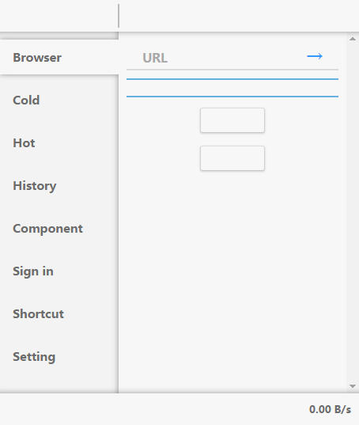

## Browser

To tell witch videos to be downloaded, users are required to browse it in the Browser tab, witch is the initial tab when the app is loaded.

Users need to enter a video URL or a command like thing to view the related videos. The command format will be introduced in the next section [Search command](#search-command).


The following shows to view all videos witch are related to `y user munimunibekkan`.


Each video items is displayed with some key information

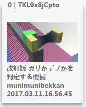

|Infomation|Value in the image above|
|---|---|
|Item index|0|
|ID|TKL9x8jCpto|
|State indicator|-The span above the image-|
|Cover|-The image-|
|Duration(Optional)|-Not shown-|
|Title|改訂版 ガリかデブかを判定する機械|
|Author(Optional)|munimunibekkan|
|Uploaded date|2017.03.11.16.56.45|

The state indicator would be one of four state.

|State|Description|
|---|---|
|Blank|The Initial state|
||This item is selected but not comitted|
||This item is comitted|
||This item has been downloaded|

The date would be showed in the users' time zone.


Users can dicide which videos to be downloaded by clicking their images. Or enter `ctrl+a` to select all videos of the current page ignoring those who have been downloaded.

To unselect a video, a user need to click its image again. And can enter `shift+ctrl+a` to unselect all selection of the current page.

## Search command

All commands has two parts except complete URLs copied from internet browsers and some special forms. The first part is the name of the site, the second part is detailed information to locate some videos (eg. ` SiteName  Detail `). The spaces around and redundant spaces in between would be ignored, and the commands are case insensitive.

All site names may have aliases, and the shortest one would be used in the following introduction.

### Bilibili
Aliases : Bili, B.
#### Video ID
RegExp `/^(\d+)$/`, `/(?:^|[^a-z])av(?:[^a-z]\D*)??(\d+)/i`  
Examples  
`av314`  
`b 314`  
`b av314`  
`http://www.bilibili.com/video/av314`
#### Uploader
RegExp `/(?:^|[^a-z])space(?:[^a-z]\D*)??(\d+)/i`  
Examples  
`b space 70093`  
`https://space.bilibili.com/70093`
#### Bangumi
RegExp `/(?:^|[^a-z])(?:anime|bangumi)(?:[^a-z]\D*)??(\d+)/i`  
Examples  
`b anime 4771`  
`b bangumi 4771`  
`http://bangumi.bilibili.com/anime/4771`
#### Mylist
RegExp `/(?:^|[^a-z])mylist(?:[^a-z]\D*)??(\d+)/i`  
Examples  
`b mylist 9`  
`http://www.bilibili.com/mylist9`
#### Dynamic
Require signing in.  
RegExp `/^(?:dynamic)?$/i`  
Examples  
`b`  
`b dynamic`
#### Search
RegExp `/^(?:find|search)\s+(.*)$/i`  
Examples  
`b find test something`
### YouTube
Aliases : YTB, Y.
#### Video ID
RegExp `/v=([^&]+)/`, `/^([_0-9A-Za-z-]+)$/`  
Examples  
`y 9bZkp7q19f0`  
`y v=9bZkp7q19f0`  
`https://www.youtube.com/watch?v=9bZkp7q19f0`
#### Uploader
RegExp `/(?:^|[^a-z])user(?:[\s\/]+)??([_0-9A-Za-z-]+)/i`  
Examples  
`y user munimunibekkan`  
`https://www.youtube.com/user/munimunibekkan`
#### Channel
RegExp `/(?:^|[^a-z])channel(?:[\s\/]+)??([_0-9A-Za-z-]+)/i`  
Examples  
`y channel UCyKNzTQpYtKliiBmz4Ep5Hw`  
`https://www.youtube.com/channel/UCyKNzTQpYtKliiBmz4Ep5Hw`
#### Playlist
RegExp `/(?:^|[^a-z])playlist(?:[^a-z]\D*)??(\d+)/i`, `/list=([^&]+)/i`  
Examples  
`y playlist UUyKNzTQpYtKliiBmz4Ep5Hw`  
`https://www.youtube.com/playlist?list=UUyKNzTQpYtKliiBmz4Ep5Hw`
#### Subscription
Require signing in.  
RegExp `/^(?:sub(?:scri(?:be|ptions?))?)?$/i`  
Examples  
`y`  
`y subscription`
#### Search
RegExp `/^(?:find|search)\s+(.*)$/i`  
Examples  
`y find 4k test`
### NicoNico
Aliases : ニコニコ, ニコ, Nico, N.
#### Video ID
RegExp `/^(\d+)$/`, `/(?:^|[^a-z])av(?:[^a-z]\D*)??(\d+)/i`  
Examples  
`sm9`  
`n 9`  
`n sm9`  
`http://www.nicovideo.jp/watch/sm9`
#### Uploader
RegExp `/(?:^|[^a-z])user(?:[^a-z]\D*)??(\d+)/i`  
Examples  
`n user 25371352`  
`http://www.nicovideo.jp/user/25371352`
#### Mylist
RegExp `/(?:^|[^a-z])mylist(?:[^a-z]\D*)??(\d+)/i`  
Examples  
`n mylist 52151642`  
`http://www.nicovideo.jp/mylist/52151642`
#### ニコレポ
Require signing in.  
RegExp `/^(?:repo|my|top)?$/i`  
Examples  
`n`  
`n my`  
`n top`
#### Search
RegExp `/^(?:find|search)\s+(.*)$/i`  
Examples  
`n find けものフレンズ`
### ToonsTV
Aliases : Toons, T.
#### Video ID
RegExp `/channels\/([0-9A-Z_]+\/[0-9A-Z_]+)/i`, `/^([0-9A-Z_]+\/[0-9A-Z_]+)$/i`  
Examples  
`t Piggy_Tales_3/6411f1c08a224700`  
`https://www.toons.tv/channels/Piggy_Tales_3/6411f1c08a224700`
#### Channel
RegExp `/channels\/([0-9A-Z_]+)/i`, `/^([0-9A-Z_]+)$/i`  
Examples  
`t Piggy_Tales_3`  
`https://www.toons.tv/channels/Piggy_Tales_3`
#### All
Require loading component.  
RegExp `/^$/`  
Examples  
`t`

## Cold

The `Cold` tab is something like a todo list, which allows users to confirm their selection, because they might select some videos by mistake. This list is only stored in memory.

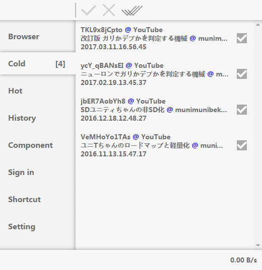

|Icon|Action|
|:---:|---|
||Commit the current task|
||Commit selected tasks|
||Remove selected tasks|
||Commit all tasks|

## Hot

After committing, tasks are appended to `Hot` list and are started immediately.

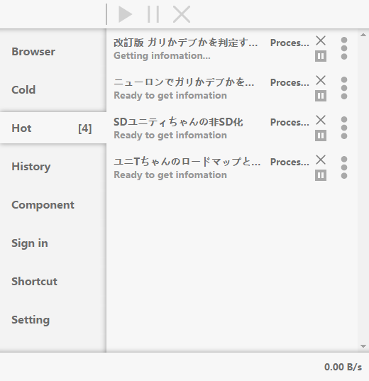

|Icon|Action|
|:---:|---|
| |Pause or restart the current task|
||Remove the current task|
|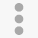|View detail infomation of the current task|
||Pause selected tasks|
||Restart selected tasks|
||Remove selected tasks|

The detail information would be shown like this.

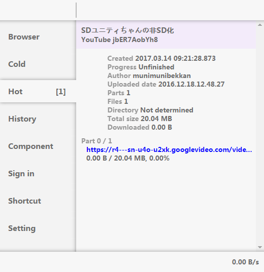

## History

A completed task would be removed from the `Hot` list and be appended to the `History` list.

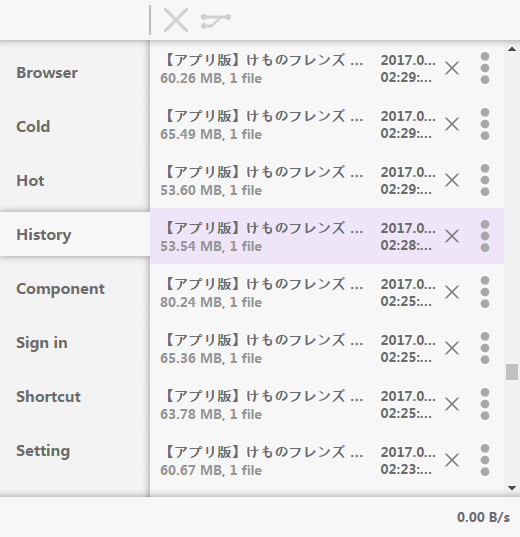

|Icon|Action|
|:---:|---|
||Remove the current item|
||View detail information of the current item|
||Remove selected items|
||Generate merge command for selected items|

Because some sites split a video into many sub videos. So a user may want to merge them into one video. And I am not going to force users to use the specificated merge tool, here only the command will be generate. The way to control the command output would be introduced in the [Merge command](#merge-command) section.

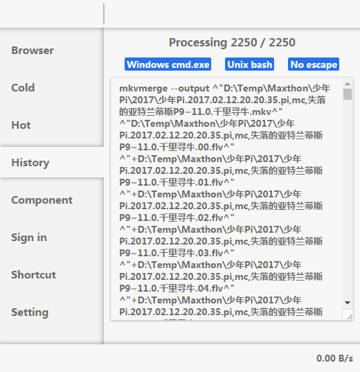

## Component

To access more information of a site, a user may need to load some components from the site.

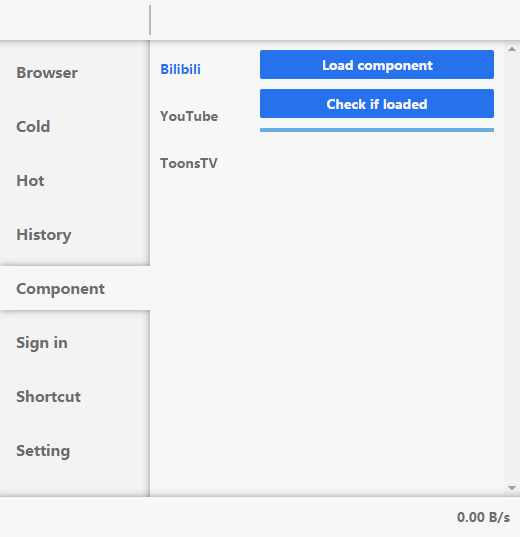

### Bilibili

Bilibili uses secret keys to prevent from getting media URLs of videos directly, and store search filters in a js file.

Here is what will happen while loading this component.  
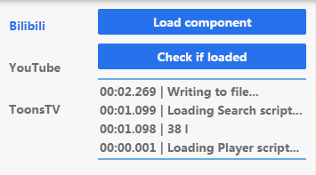

If this component is not loaded. A user would be still able to download videos, but this way may not be so stable.  
Or. A user would be able to access to 1080P videos of bangumi when the user is signed in with a `Big Member` account (though I do not think someone would download bilibili version instead of a any other versions, which is much more stable. And the user would be able to use filters while searching.

PS.  
The suffix of the download URLs control the speed when downloading. And the possible values would be `rate=4100`, `rate=1400`, `rate=1100`, `rate=49` or `dynamic=1`.  
The `rate=4100` would be the best with average speed of around 4 MB / s, but I only see these when downloading bangumi videos.  
The `rate=1400` and `rate=1100` would be the second best with average speed of around 1 MB / s, and I am not sure when it will appear.  
The `dynamic=1` would be the worst because it would transfer around 20.9 MB data as fast as possible and transfer the rest of data in a extreme slow rate in order to control the average speed to be around 200 KB / s. Although it is possible to speed up by pausing-restarting, it is very bothering.  
The `rate=49` is only be seen while requesting by IP outside China.

### YouTube

Some videos like `My2FRPA3Gf8` are protected with a `sig` field, so without loading this component, these videos cannot be downloaded.

Here is what will happen while loading this component.  
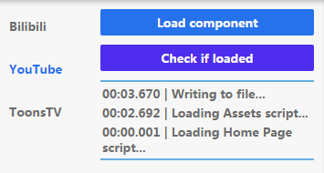

### ToonsTV

There seems no direct ways to load a full list of active videos of ToonsTV, so I use a alternative way to load the full list, after loading this component, a user would be able to view the list by entering `t` in the browser tab.

Here is what will happen while loading this component.  
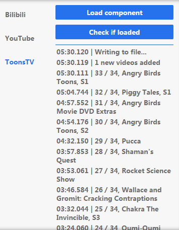

## Sign in

Some sites require to sign in to access part of its videos, so here gives the way to sign in.

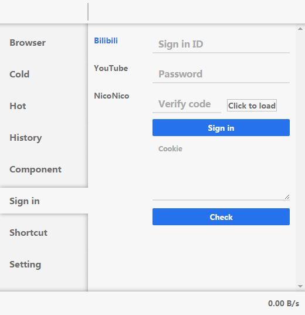

A user can sign in by inputing required infomation and then clicking the `Sign in` button, or by pasting the Cookies in to the Cookie input area and then clicking the `Check` button.

**\* The information would not be collected, but the cookies would be stored into the local machine.**

## Shortcut

Some actions can be done by keyboard shortcuts, and they are all configurable.

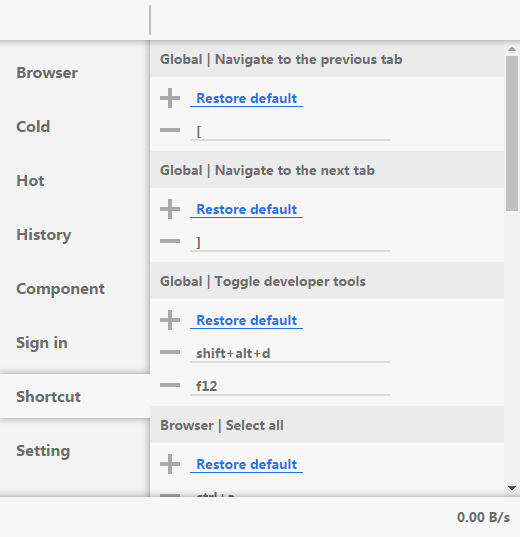

|Action|Default|
|---|---|
|Global \| Navigate to the previous tab|`[`|
|Global \| Navigate to the next tab|`]`|
|Global \| Toggle developer tools|`shift+alt+d`, `f12`|
|Global \| Close covering pages (Detail or Merge page)|`esc`|
|Browser \| Focus on the URL input|`f1`|
|Browser \| Select all|`ctrl+a`|
|Browser \| Clear selection|`shift+ctrl+a`|
|Browser \| Navigate to the first page|`h`|
|Browser \| Navigate to the previous page|`j`|
|Browser \| Navigate to the next page|`k`|
|Browser \| Navigate to the last page|`l`|
|List \| Select all|`ctrl+a`|
|List \| Clear selection|`esc`|

## Setting

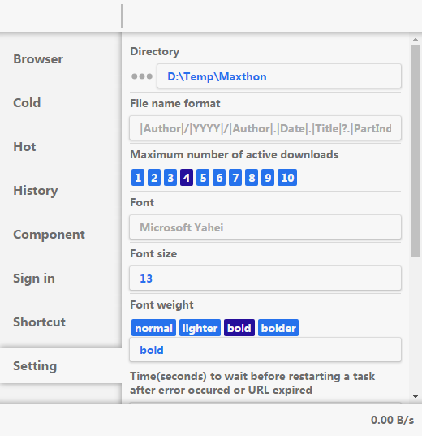

Some settings will be described below.

### Setting Directory (Not shown in the GUI interface)

This folder is used to store all settings and other files.
The default value would be  
`%CRABSAVEPATH%` if CRABSAVEPATH exists in environment  
or `%HOME%/ZED/CrabSave` if HOME exists  
or `%HOMEDRIVE%%HOMEPATH%/ZED/CrabSave` if HOMEDRIVE and HOMEPATH both exist  
or `%USERPROFILE%/ZED/CrabSave` if USERPROFILE exists

### Download Directory

The root folder to store all downloaded videos.  
The default value would be sub folder `Download` inside the setting directory

### File name format

Default `|Author|/|YYYY|/|Author|.|Date|.|Title|?.|PartIndex|??.|PartTitle|??.|FileIndex|?`

The relative path to the root folder for a certain video.

A `|FieldName|` will be convert into the infomation related to a video, and a `?OptionalPart?` means that this part is optional and will only work if every `|FieldName|` parts inside exist.

Available fields

|Field|Description|
|---|---|
|\|ID\||The ID|
|\|Author\||The uploader|
|\|Title\||The title|
|\|YYYY\||The year of the created date|
|\|MM\||The month of the created date|
|\|DD\||The day of the created date|
|\|HH\||The hour of the created date|
|\|NN\||The minute of the created date|
|\|SS\||The seconds of the created date|
|\|Date\||Shortcut of `|YYYY|.|MM|.|DD|.|HH|.|NN|.|SS|`|
|\|PartIndex\||(Optional) The index of a sub part counted from 0|
|\|PartTitle\||(Optional) The title of a sub part|
|\|FileIndex\||(Optional) The index of a file in a splited video counted from 0|

For example, with the following infomation.

|Field name|Description|
|---|---|
|\|ID\||314|
|\|Author\||UP|
|\|Title\||TITLE|
|\|YYYY\||2124|
|\|Date\||2124.12.24.21.24.00|
|\|FileIndex\||8|

And the file would be in mp4 format, then the final path would be `UP/2124/UP.2124.12.24.21.24.00.TITLE.8.mp4`.

### Merge command

Default
```js
"mkvmerge",
"--output",
"|Output|",
"|Head|",
["+|Tail|"]
```

The language here to generate merge command is designed not to be too complicate, so if a merge tool's command format is too complicate, it is recommand to create a batch/shell file receiving a list of files to be merged and do the complicate work inside.

The value of this setting would be a JSON array, and the `[` `]` around could be omitted.  
The first item would always be treated as a `string` because it is the target to execute the command.  
The following items would be `string` or `string[]`, other wise they would be converted into `string`.  
If a item is a `string`, it means that it is one single parameter, and can contains variables in the following table.

|Field|Description|
|---|---|
|\|Output\||The full path of the merged file|
|\|Head\||The full path of the first file|

Or if a item is a `string[]`, then it means that it is a loop of multi parameters. If parameters inside contain `|Tail|`, then the loop is based on all full paths of files except the first one, otherwise the `|List|` tells that the loop is based on all full paths.

For example, if the full paths of all files are  
`/X/F.0.flv`  
`/X/F.1.flv`  
`/X/F.2.flv`  
Then `["+","|List|"]` would output  
`+ /X/F.0.flv + /X/F.1.flv + /X/F.2.flv`  
While `["+","|Tail|"]` would output  
`+ /X/F.1.flv + /X/F.2.flv`  
If the output path is `/X/F.mkv`, with the default setting, it would generate  
`mkvmerge --output /X/F.mkv /X/F.0.flv +/X/F.1.flv +/X/F.2.flv`

## Build

```
npm i --dev
npm run build
```

I only tested it in a `Windows 7, x86` system, so errors may occur in other platforms.

## Known issues

* **Out of memory?** Running about 3~4 hours with an average speed around 5 MB /s, the app may crash to white screen.
* **Bad file descriptor.** 3 times in 2250 downloads, it throws an error about bad file descriptor and crash the certain task.